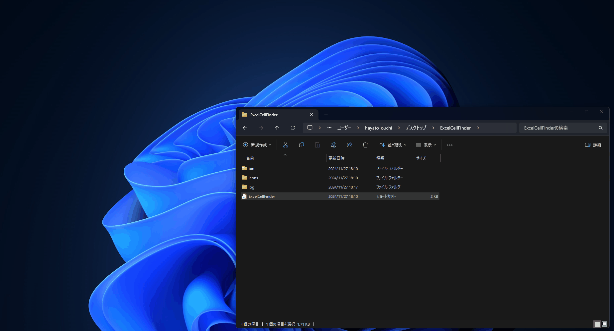

# ExcelCellFinder
## 概要
Excelファイル内のセルを検索するツールです。
デスクトップアプリケーションとしてWindows上で動作します。
## 環境
- Windows
	- Windows 11 で動作確認しています。
- Visual Studio 2022
## ビルド
Visaul Studio でRelease構成でビルドしてください。
## インストール
Release/release.zipを解凍して、任意のフォルダに配置してください。
## 使い方
ExcelCellFinder.Desktop.exeを実行します。



### 検索対象ファイル
検索対象ファイルは3つの方法で指定できます。
1. フォルダを指定
1. ファイルを指定
1. CSVファイルで指定

#### CSVファイルで指定について
フォルダをまたいで特定の複数ファイルを指定する場合は、CSVファイルで指定するのが便利です。
下記のように検索対象とするファイルを絶対パスで指定したCSVファイルを選択してください。

```csv
C:\some\foilder\Test.xlsx
C:\some\folder\Test2.xlsx
C:\another_folder\Tes2t.xlsx
C:\another\folder\sub\subsub\Tes2t.xlsx
```
- 拡張性を考慮してCSV形式としていますが、現状は1カラムのみです
- エンコーディングはUTF-8